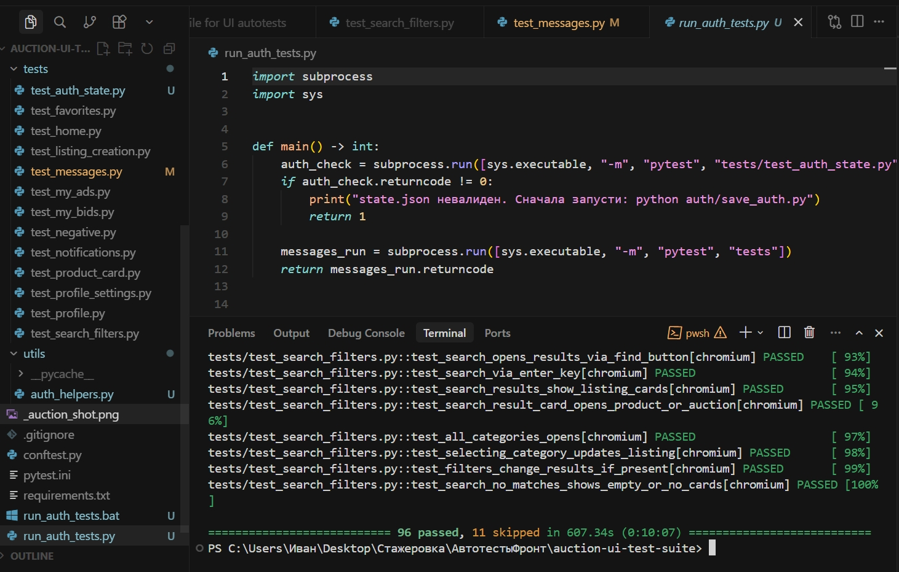
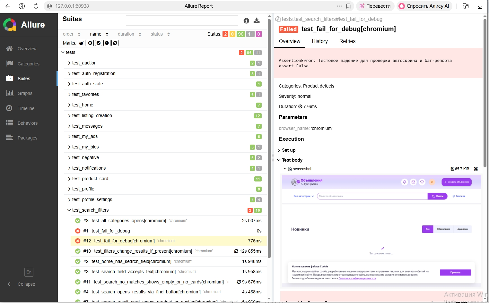
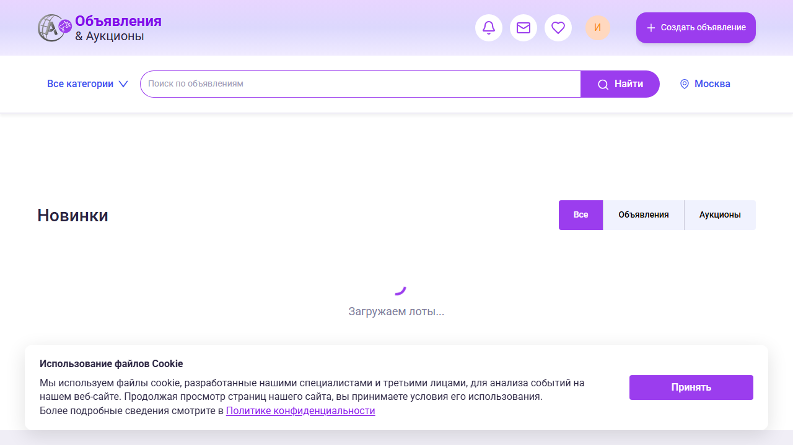
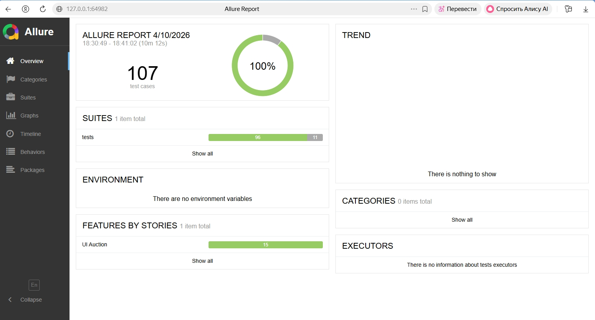

# 🎯 UI Autotests — Auction Platform

Проект может быть использован для внутреннего пользования и тестирования команды Акатосфера.

Автоматизированные UI-тесты для тестового сайта аукциона.

Проект демонстрирует автоматизацию UI-тестирования с полным циклом фиксации дефектов и формирования отчётности.

https://front.test.kp.ktsf.ru/

На текущий момент в проекте реализовано **107 UI автотестов**.

📊 Последний прогон: 96 passed / 11 skipped

### 🔥 Полный цикл фиксации дефекта

Автотесты автоматически выполняют:

- создание скриншота при падении теста
- прикрепление скриншота к Allure-отчёту
- фиксацию дефекта в отчёте
- генерацию черновика баг-репорта в папке `bugs/`

---

## ⚡ Быстрый старт

Минимальный сценарий запуска проекта:

```bash
pip install -r requirements.txt
playwright install
python auth/save_auth.py
python run_auth_tests.py
```

---

## 📥 Клонирование проекта

Склонировать репозиторий:

```bash
git clone https://github.com/imidg1825/auction-frontend-ui-autotests.git
cd auction-frontend-ui-autotests
```

---

## 📌 О проекте

Проект покрывает ключевые пользовательские сценарии веб-приложения:

- авторизация и регистрация
- работа с объявлениями
- поиск и фильтры
- избранное
- профиль пользователя
- сообщения
- ставки и аукционы
- негативные сценарии

Типы проверок:

- позитивные сценарии
- негативные сценарии
- граничные значения

---

## 🛠️ Технологии

- Python 3.14
- pytest
- Playwright
- Allure Report
- Docker

---

## 📂 Структура проекта

```text
tests/
  test_auth_registration.py
  test_auth_state.py
  test_auction.py
  test_favorites.py
  test_home.py
  test_listing_creation.py
  test_messages.py
  test_my_ads.py
  test_my_bids.py
  test_negative.py
  test_notifications.py
  test_product_card.py
  test_profile.py
  test_profile_settings.py
  test_search_filters.py

auth/
  save_auth.py
  state.json

utils/
  auth_helpers.py

run_auth_tests.py
run_auth_tests.bat
requirements.txt
pytest.ini
```

В корне также находится `conftest.py` — общие фикстуры pytest / Playwright.

---

## 🚀 Установка и запуск

### Docker

В проект добавлен Dockerfile для контейнеризации тестового окружения.

Базовый сценарий сборки и запуска:

```bash
docker build -t auction-ui-tests .
docker run --rm auction-ui-tests
```

Для использования сохранённой сессии можно примонтировать папку с файлом `state.json`:

```bash
docker run --rm -v %cd%/auth:/app/auth auction-ui-tests
```

Важно:
контейнер позволяет воспроизвести тестовое окружение и запуск автотестов.

Для выполнения авторизованных сценариев требуется файл `auth/state.json`.

Теоретически авторизацию можно выполнить вручную внутри контейнера (ввести email и OTP-код),
однако на практике это неудобно, так как контейнер запускается в headless-режиме.

Рекомендуемый сценарий:
сначала выполнить авторизацию локально (через `python auth/save_auth.py`),
после чего использовать готовый `state.json` внутри контейнера.

### Windows

Все команды выполняются из корня проекта.

1. Установка зависимостей

```bash
pip install -r requirements.txt
playwright install
```

2. Обновление авторизации

```bash
python auth/save_auth.py
```

Далее:

- откроется браузер
- нажмите «Войти»
- введите email
- введите код из почты
- после полной авторизации нажмите Enter в консоли

Будет создан файл:

`auth/state.json`

3. Запуск всех тестов

```bash
python run_auth_tests.py
```

или:

```bash
.\run_auth_tests.bat
```

### Linux / macOS

```bash
pip install -r requirements.txt
playwright install

python auth/save_auth.py
python run_auth_tests.py
```

---

## 🧪 Запуск через pytest

Любой набор тестов:

```bash
# запуск всех тестов
pytest tests/
```

С генерацией Allure-результатов:

```bash
# запуск с генерацией Allure
pytest tests/ --alluredir=allure-results
```

---

## 📊 Allure отчёт

После прогона:

```bash
allure serve allure-results
```

В отчёте реализовано:

- группировка по Epic: UI Auction
- разбиение по Feature:
  - Auth
  - Auction
  - Favorites
  - Messages
  - Search
  - Profile и др.

Также:

- отображаются passed / skipped тесты
- есть описание сценариев
- указаны причины skipped

Отчёт позволяет быстро оценить стабильность тестов и покрытие основных сценариев.

---

## ⚙️ Что реализовано

- единая точка запуска: run_auth_tests.py
- проверка валидности сессии перед прогоном
- использование state.json для авторизованных тестов
- автоматическая генерация Allure-результатов
- логика skip для нестабильных/зависимых сценариев
- при падении UI-теста автоматически создаётся скриншот страницы
- скриншот прикрепляется к Allure-отчёту (доступен прямо внутри упавшего теста)
- автоматически фиксируется факт дефекта в отчёте (Allure Categories)
- на основе failed-прогона формируется черновик баг-репорта в папке `bugs/`

---

## ⚠️ Особенности проекта

- авторизация через OTP (email-код)
- автотесты используют сохранённую сессию
- при невалидной сессии прогон останавливается

Часть тестов может быть skipped, если:

- требуется реальный OTP-код
- нет нужных данных на стенде
- сценарий нестабилен

Подробный разбор актуальных skipped-сценариев вынесен в `docs/skip_analysis.md`.

При падении тестов дефекты фиксируются и оформляются в папке `bugs/` с использованием шаблона баг-репорта.

---

## 📈 Текущее состояние

По последнему прогону:

- 107 тестов собрано
- 96 passed
- 11 skipped

Количество skipped снижено за счёт:

- стабилизации сценариев
- использования сохранённой авторизации

## 📊 Примеры результатов

Ниже приведены примеры реального прогона тестов и автоматической фиксации дефектов.

### 💻 Результат прогона (pytest)


---

### ❌ Пример падения теста + автоскрин


---

### 📸 Скриншот страницы (из автотеста)


---

### ✅ Финальный Allure отчёт


---

## 👨‍💻 Автор

Иван  
QA Automation Engineer
